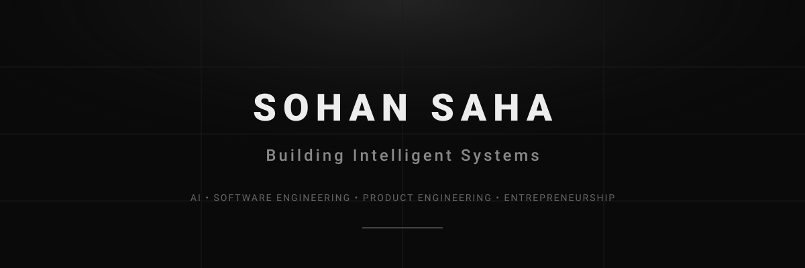

<div align="center">



<br/>

# SOHAN SAHA

### AI/ML • INTELLIGENT SYSTEMS • AI AGENTS • OPEN SOURCE

**B.Tech Artificial Intelligence & Machine Learning @ REVA University, Bengaluru**

[](https://github.com/sohansa035-bot)
[](https://www.linkedin.com/in/sohan-saha-130353399/)
[](mailto:sohansa035@gmail.com)

</div>

---

### About

I'm Sohan Saha, a B.Tech Artificial Intelligence & Machine Learning student focused on building AI-powered products and intelligent systems. I enjoy turning ideas into working systems through experimentation, engineering, and open-source development.

**Interests:** Artificial Intelligence • Machine Learning • AI Agents • Intelligent Systems • Computer Vision • Autonomous Systems • AI Product Development • Open Source

---

### What I Build

```
AI / ML  →  AI Agents  →  Intelligent Systems  →  Practical Applications
```

I focus on building systems where AI can:
- **Observe** the environment via real-time sensory data and telemetry
- **Reason** through multi-step diagnostic and predictive models
- **Decide** optimal action pathways and mitigation strategies
- **Interact** with external APIs, operators, and physical hardware
- **Automate** operational workloads and incident resolution

---

### Featured Projects

#### 01 — [YUGĒN](https://github.com/sohansa035-bot/Yugen)
**AI-Powered Autonomous Surveillance Rover**  
A modular robotics platform exploring edge AI, real-time computer vision, and autonomous surveillance. Replaces fixed surveillance with an active, mobile system featuring live video streaming, low-latency teleoperation, and on-device detection.
- **Technologies:** `ESP32` • `YOLOv8` • `Computer Vision` • `IoT` • `OpenCV` • `Python`
- **Focus:** Edge inference, object tracking, remote piloting, and modular hardware integration.

#### 02 — [OpenEnv](https://github.com/sohansa035-bot/OpenEnv)
**AI Agent Environment for SRE Tasks**  
An open benchmark and evaluation environment for assessing autonomous AI agents on software reliability engineering and incident-response tasks under realistic production scenarios.
- **Technologies:** `AI Agents` • `Python` • `Docker` • `FastAPI` • `Simulation` • `Reinforcement Learning`
- **Focus:** Dynamic system health decay, multi-step diagnostic reasoning, priority triage, and deterministic scoring.

#### 03 — [AutoSRE-PostMortem](https://github.com/sohansa035-bot/AutoSRE-PostMortem)
**Autonomous SRE Incident-Response Platform**  
An experimental platform designed to evaluate end-to-end incident handling workflows from anomaly detection to automated postmortem generation.
- **Technologies:** `AI Agents` • `Python` • `Root Cause Analysis` • `Simulation` • `Safety Controls`
- **Focus:** Root cause analysis (RCA), counterfactual planning, safety policies, remediation, verification, benchmarking, and automated postmortem generation.

#### 04 — [AI-SOC Threat Pipeline](https://github.com/sohansa035-bot/AI-SOC-Threat-Pipeline)
**AI-Assisted Security Operations**  
An automated triage and threat-analysis pipeline applying AI and Python automation to assist security analysts in monitoring, prioritizing, and analyzing security events.
- **Technologies:** `Python` • `AI` • `Security` • `Automation` • `Threat Analysis`
- **Focus:** Event log parsing, threat categorization, triage workflows, and analyst decision support.

#### 05 — [TerraSense](https://github.com/sohansa035-bot/TerraSense)
**AI-Powered Agricultural Intelligence**  
An experimental AgriTech project focused on intelligent agricultural decision support through sensor telemetry and data-driven analysis.
- **Technologies:** `Python` • `Machine Learning` • `Data Analysis` • `AgriTech` • `IoT`
- **Focus:** Crop health evaluation, environmental data modeling, and actionable agricultural recommendations.

#### 06 — [OceanIntel](https://github.com/VyomVadodariya/OceanIntel)
**Satellite-Based Oil Spill Detection & Maritime Investigation Intelligence**  
A geospatial intelligence system that combines Sentinel-1 SAR satellite imagery, deep-learning segmentation (U-Net / ResNet-34), ocean drift backtracking, and AIS vessel correlation to identify and rank candidate vessels for marine oil spill investigations.
- **Technologies:** `Sentinel-1 SAR` • `PyTorch` • `U-Net` • `ResNet-34` • `CMEMS` • `ERA5` • `FastAPI` • `MapLibre GL`
- **Focus:** SAR preprocessing, low-backscatter oil slick segmentation, kinematic particle drift inversion, and AIS spatio-temporal correlation.

#### 07 — [FloodX](https://github.com/VyomVadodariya/FloodX)
**AI-Powered Hyperlocal Flash-Flood Intelligence & Evacuation System**  
A proactive disaster-intelligence and decision-support engine for flash-flood risk forecasting and graph-based evacuation routing in mountainous regions, combining time-series hazard modeling, uncertainty quantification, dynamic vulnerability tracking, and generative emergency alerting.
- **Technologies:** `Python` • `Time-Series ML` • `NetworkX` • `Amazon Bedrock` • `AWS Lambda` • `MongoDB Atlas` • `IoT`
- **Focus:** Multi-horizon flood forecasting, dynamic risk assessment (hazard × exposure × vulnerability), predictive road graph evacuation routing, and multilingual emergency alerts.

---

### Technical Focus

| Domain | Areas & Tools |
| :--- | :--- |
| **AI / ML** | Python • OpenCV • YOLOv8 • NumPy • Pandas • Hugging Face • Lyzr • OpenEnv |
| **Intelligent Systems** | AI Agents • Computer Vision • Autonomous Systems • IoT Systems • Edge Computing |
| **Engineering & Tools** | C • Docker • Git • GitHub • ESP32 |

---

### Open Source

I participate in open-source development across AI, Machine Learning, AI Agents, Intelligent Systems, and Developer Tools. I use open source to:
- **Experiment** with novel architectures and agent benchmarks
- **Collaborate** with developers and researchers
- **Learn** from existing systems, architectures, and design patterns
- **Build and share** reproducible tools and research prototypes

---

### Experience

**Technical & Digital Operations Intern** — OptCELL Global  
*December 2025 – March 2026*
- Supported digital operations and assisted in internal product engineering initiatives.
- Collaborated across engineering workflows on feature implementation and operational support.

---

### Leadership

**Technical Co-Head** — IEEE TEMS REVA University  
*REVA University Student Chapter*
- Contributing to technical initiatives, innovation programs, hackathons, and engineering activities within the student community.

---

### Currently Exploring

`Artificial Intelligence` • `Machine Learning` • `AI Agents` • `Computer Vision` • `Intelligent Systems` • `Autonomous Systems` • `AI Product Development` • `Open Source`

---

### Engineering Approach

```
UNDERSTAND  →  EXPERIMENT  →  BUILD  →  TEST  →  REFINE
```

I approach engineering through deliberate problem analysis, hands-on experimentation, and iterative building. Rather than relying on assumptions, I validate concepts by building working systems, testing failure modes, and refining implementations through practical feedback.

---

### Beyond Technology

Outside of engineering, I enjoy playing **Cricket**, **Football**, and **Badminton**, as well as **Drawing**.

---

### GitHub Activity

<div align="center">
  
  
</div>

---

### Contact

<div align="center">

<a href="https://github.com/sohansa035-bot">
  
</a>
&nbsp;
<a href="https://www.linkedin.com/in/sohan-saha-130353399/">
  
</a>
&nbsp;
<a href="mailto:sohansa035@gmail.com">
  
</a>

<br/><br/>

**Building systems. Exploring intelligence. Learning in public.**  
<sub>Building deliberately. Learning continuously.</sub>

</div>
